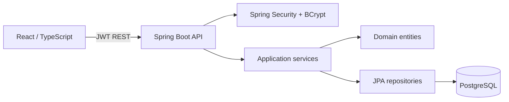
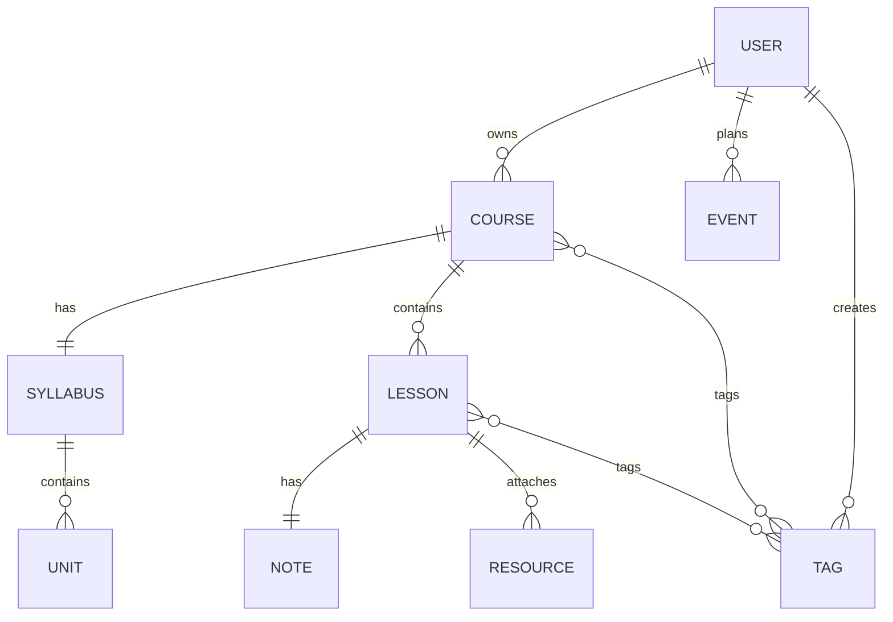

# StudyHub

Plataforma personal de estudio: React + TypeScript/Vite en `frontend` y Java 21/Spring Boot en `backend`.

## Puesta en marcha

1. Copie `.env.example` como `.env` y ajuste las credenciales.
2. Inicie PostgreSQL: `docker compose up -d db`.
3. Backend: `cd backend && mvn spring-boot:run`.
4. Frontend: `cd frontend && npm install && npm run dev`.

La cuenta de desarrollo se crea al iniciar: `harold@studyhub.local` / `ChangeMe123!` (cámbiela inmediatamente).

## Arquitectura

El backend organiza cada módulo en `api` (controllers y DTOs), `application` (casos de uso), `domain` (entidades y reglas) e `infrastructure` (JPA/seguridad). Los módulos actuales son autenticación, cursos, clases y notas; recursos, agenda, búsqueda y exportación tienen contratos y entidades preparados para extenderse sin romper el núcleo.

## Modelo de datos

## Fases de implementación

1. Fundaciones: seguridad, modelo, migraciones y navegación protegida.
2. Aprendizaje: CRUD de cursos, sílabos, clases y editor Markdown.
3. Organización: recursos, etiquetas, búsqueda, calendario y progreso.
4. Consolidación: exportación, pruebas, auditoría y despliegue.

## Producción

Use secretos fuertes para JWT y base de datos, configure almacenamiento de objetos para recursos, ejecute el frontend con CDN/HTTPS y el backend detrás de un proxy inverso. Nunca exponga el perfil `dev`.
